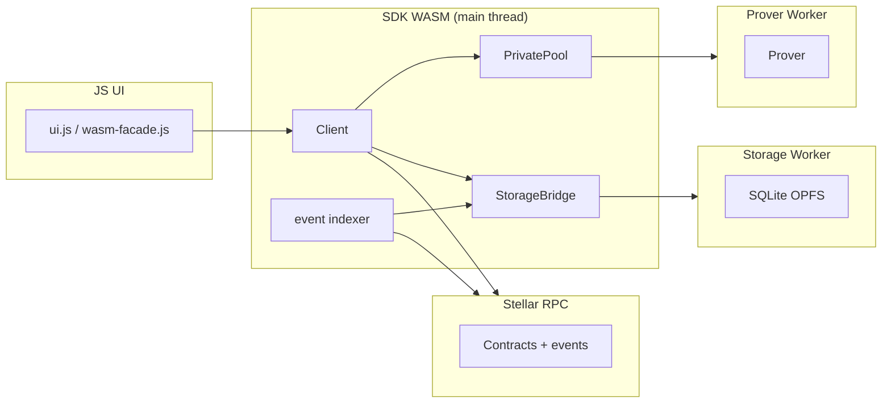

# App Architecture

This document describes how the browser application manages local state, WASM runtime, and on-chain data.

## Overview

**SDK vs app**

Core logic lives in `sdk/` (Rust). The browser consumes **`stellar-private-payments-sdk-web`** (`sdk/web` on npm, staged under `/js/stellar-private-payments-sdk-web/` by Trunk).

App-specific persistence (settings, disclaimer, operation history) stays in **`app/js/app-storage.js`** (`AppStorage`), accessed via **`appStorage()`**. SDK session + storage-backed reads (keys, notes, feeds, ASP helpers) go through **`client()`** — the wrapped SDK `Client` from **`app/js/wasm-facade.js`**.

**Lifecycle (main app)**

```
Storage.open() → Client.new(rpcUrl) → checkEventSync / startEventSync
  → initializeWallet(signer) → openPool({ poolContract })
```

**Storage**

Local state uses SQLite (`sdk/state`) with OPFS in the browser storage worker.

## Browser runtime

| Layer | Role |
|-------|------|
| **`wasm-facade.js`** | Runtime init, `client()` (SDK + session reads), `appStorage()` |
| **`app-storage.js`** | `AppStorage` — settings, disclaimer, op history |
| **SDK `Client`** | Event sync, wallet init, registry, `allContractsData`, `pool()` factory |
| **SDK `PrivatePool`** | Per-pool deposits, transfers, withdrawals, transact, disclose |
| **Storage worker** | SQLite + note scan / decrypt / derived state |
| **Prover worker** | Groth16 proving and disclosure verification |

JS never talks to workers directly; the SDK WASM layer owns worker spawning and the typed protocol in `sdk/web/src/protocol.rs`.

### Disclosure page

- **Generate** (wallet): `initializeRuntime` → `startEventSync` → `initializeWallet` → `openPool` → `pool.disclose({...})`.
- **Verify** (walletless): `initializeRuntime` → `startEventSync` → `Client.verifySelectiveDisclosure(receiptJson, vkHash)` (prover worker spawned on demand).

### Admin page

- `initializeWasm` opens storage + event sync without a wallet session.
- `deriveAspUserLeaf` works via `client()` (storage worker, no wallet).
- `client().aspState()` / `client().allContractsData()` require `initializeWallet` (known limitation).

## Data flow (high level)



**Keypair derivation**

Keys are derived deterministically from a Freighter wallet signature on `initializeWallet` (SDK). Derived keys are stored in the storage worker and reused on later connects.

### Public key registry

Maintains an address book of registered public keys on-chain for private transfers to `G...` addresses.

## Recovery scenarios

### Clearing browser data

All stored data is lost. On next load the app re-syncs from RPC (within retention, typically ~7 days), rebuilds Merkle trees, and prompts for key derivation again.

### Account switch

Disconnect resets the wallet session shell; reconnect runs `initializeWallet` for the new account.
