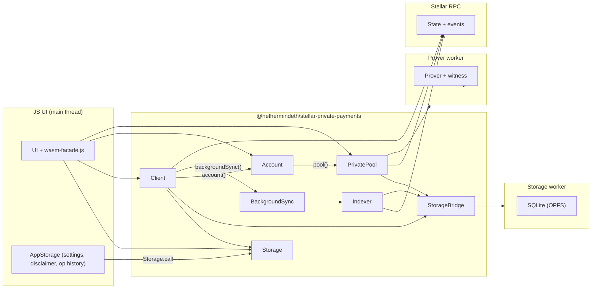

# App Architecture

This document describes how the application manages local state, including persistent storage and on-chain data.

## Overview

**Core vs browser SDK vs app**

| Layer | Location | Role |
|-------|----------|------|
| **Rust SDK** | `sdk/client` | Rust `PrivatePool` — deposits, transfers, withdrawals, transact, disclose |
| **Web SDK** | `sdk/web` | npm package `@nethermindeth/stellar-private-payments` — WASM bindings, workers, `Storage` / `Client` / `PrivatePool` JS API |
| **App** | `app/js` | UI, Freighter connect UX, `wasm-facade.js` lifecycle, `app-storage.js` for app-only persistence |

Core application logic lives in Rust `sdk/` crates (sync primitives, indexer, tx builders, proving, SQLite schema). The browser SDK (`sdk/web`) compiles that logic to WASM and exposes a typed JavaScript API. The `app/` directory is the web UI and a thin runtime facade — it does not embed its own WASM crate.

**Storage**

Local storage is SQLite (`sdk/state/src/storage.rs`, schema in `sdk/state/src/schema.sql`), shared across platforms. In the browser the database file (`spp.db`) lives on OPFS behind the storage worker.

## Browser SDK (`sdk/web`)

The web SDK runs Rust on the main thread via WASM, with blocking work offloaded to Web Workers. It is built with `npm run build` in `sdk/web` and consumed by the app as a local npm dependency (`app/package.json` → `file:../sdk/web`).

### Lifecycle

```
init() → Storage.open() → bootnodeRequired() → Client.new() → backgroundSync() → client.account(signer) → account.pool() → PrivatePool ops
```

The app wraps this in `wasm-facade.js` and `ui/pool.js`: `bootnodeRequired` → `initializeRuntime` → `client().backgroundSync` → `client().openAccount` → `account().pool()` via `createAppPool()` / `ensureAppPool()`.

### Components

The WASM layer exposes four JS handles with different scope:

| Handle | Scope | Examples |
|--------|-------|----------|
| **`Storage`** | Page-local persistence (one worker per tab) | `open`, `fork`, `call` (app-layer settings only) |
| **`Client`** | Deployment runtime (storage, RPC, sync) | `contractConfig`, `backgroundSync`, `operationalFeed`, `recipientLookup`, `account()` |
| **`Account`** | Wallet session (address + signer) | `portfolio`, `userPublicKeys`, `aspSecret`, `userNotes`, `isRegistered`, `deriveAspUserLeaf`, `registerPublicKeys`, `pool()` |
| **`PrivatePool`** | One pool contract + user session | `deposit`, `transfer`, `withdraw`, `transact`, `disclose`, `balance`, `notes` |

`Client` is the long-lived deployment shell; `Account` is created when the wallet binds; `PrivatePool` is created per active pool when the user transacts.

**JS UI (main thread)**

The UI is JavaScript. It imports the SDK package (or `wasm-facade.js` helpers) and does not talk to workers directly.

**Main thread (WASM)**

- Entry: `init()` from `@nethermindeth/stellar-private-payments` (wasm-bindgen module init).
- `Client::new` forks a `Storage` handle and holds RPC URL + optional bootnode; wallet binding happens at `account`.
- `Client::backgroundSync` spawns the native SDK `BackgroundSync` loop (`wasm_bindgen_futures::spawn_local`).

**Indexer (client SDK + web SDK)**

- Generic over a storage backend (`Indexer<S: ContractDataStorage>`).
- On web, the backend is **`StorageBridge`**, implementing `ContractDataStorage` and the client SDK `Storage` trait by forwarding to the storage worker.
- `BackgroundSync::run` (`sdk/client/src/sync.rs`) owns the long-running loop: `Indexer::init`, periodic `fetch_contract_events`, bootnode handoff when the wallet RPC has a retention gap. `bootnodeRequired` (native `bootnode_required`, wasm in `sdk/web/src/bootnode.rs`) is a one-shot probe only.
- Background sync is owned by that loop. Pool sessions do not expose `sync()`; use `client.sync()` for an explicit catch-up when needed.

**`Storage` (WASM, wasm-bindgen API)**

- Spawns the storage worker once per page (`Storage.open({ workerUrl? })`).
- `fork()` returns another handle to the same worker/DB (used internally by `Client::new`).
- `call(request, timeoutMs?)` exposes the typed worker protocol for advanced/app-layer use.

**`Client` (WASM, wasm-bindgen API)**

- Constructed by `Client.new({ rpcUrl, storage, proverWorkerUrl?, bootnodeUrl? })` — wraps native SDK `Client` plus worker bridges; no wallet yet.
- Spawns the prover worker at `Client.new`; pings it on `account()` / prove paths. Routes storage through `StorageBridge`.
- **Deployment-wide operations:**
  - Background sync via `backgroundSync`.
  - Chain reads without a wallet: `contractConfig`, `operationalFeed`, `recipientLookup`, `allContractsData`, `aspState`, `verifySelectiveDisclosure`.
  - Account factory via `account({ networkPassphrase, userAddress? }, signer)`.

**`Account` (WASM, wasm-bindgen API)**

- Wallet session: thin wrapper over native `Account`.
- **Account-wide operations:**
  - Key derivation on first `account()` (Freighter `signMessage` when keys missing in local DB).
  - Reads: `portfolio`, `userPublicKeys`, `aspSecret`, `userNotes`, `isRegistered`, `deriveAspUserLeaf`.
  - `registerPublicKeys`.
  - Per-pool sessions via `pool({ poolContract })`.

**`PrivatePool` (WASM, wasm-bindgen API)**

- Per-pool session: client SDK `PrivatePool<StorageBridge>` with RPC fetcher, shared storage bridge, prover bridge, and wallet signer.
- **Pool-scoped operations** — the app caches the handle in `ui/pool.js` (`activeSession` via `createAppPool` / `ensureAppPool` / `closeAppPool`) until wallet disconnect or pool switch.
- Exports: `balance`, `notes`, `estimate`, `deposit`, `transfer`, `transferToKeys`, `withdraw`, `transact`, `disclose`, `verifyDisclosure`.
- Amounts are **stroops** as JavaScript `bigint` (same units as Rust `NoteAmount`).
- Proving, signing, and submit run inside this session; returns tx hashes to JS.

**`StorageBridge` (WASM main thread)**

- Typed async bridge to the storage worker (`StorageWorkerRequest` / `StorageWorkerResponse` in `protocol.rs`).
- Used by the indexer, `PrivatePool`, and wasm `Client` storage reads.

**Storage worker (Web Worker)**

- Owns SQLite on OPFS.
- Saves raw contract events, processes events, scans/decrypts notes, maintains derived state.
- Processes in small chunks and yields between batches to stay responsive.

**Prover worker (Web Worker)**

- Long-running Groth16 proving and witness calculation.
- Does not persist user state; caches circuit artifacts in memory.

### Worker protocol

The `sdk/web` crate owns worker spawning and communication. Messages are strongly typed enums in `protocol.rs` (`StorageWorkerRequest/Response`, `ProverWorkerRequest/Response`). The protocol is not part of the public JS API except via `Storage.call` for app-layer extensions.

### Data flow



## App runtime (`app/js`)

**`wasm-facade.js`**

Single entry for the main app pages. Owns singleton lifecycle:

1. `bootnodeRequired(rpcUrl)` — probe retention; configure/persist bootnode if needed
2. `initializeRuntime(rpcUrl)` — `init()`, `Storage.open`, `Client.new` (loads stored bootnode)
3. `client().backgroundSync()` — spawn indexer
4. `client().openAccount({ networkPassphrase, userAddress }, signer)` — `Client.account`
5. `createAppPool()` / `ensureAppPool()` in `ui/pool.js` — `account().pool({ poolContract })`

Also wraps the SDK `Client` for app lifecycle (`openAccount`, cached account session). Privacy key reads use SDK methods; app-only persistence (disclaimer, explorer, bootnode, operation history) stays on `client().storage()` via `Storage.call`.

**`app-storage.js`**

App-only persistence on top of `Storage.call`: explorer settings, bootnode config, disclaimer acceptance, operation history. Not part of the published SDK.

**`app/js/wallet.js`**

Freighter connect/watch/sign UX for the app UI. Distinct from `sdk/web/js/freighter.js` (`FreighterSigner`), which implements the SDK `WalletSigner` interface passed to `Client.account`.

**Build (Trunk)**

`Trunk.toml` stages `sdk/web/dist/` (WASM, workers, **bundled circuits** under `dist/circuits/`) and bundles `sdk/web/js/index.js` into `js/@nethermindeth/stellar-private-payments/`. App bundles (`ui.js`, etc.) import `@nethermindeth/stellar-private-payments` as an external package via import maps in `index.html`.

Root-level `circuits/` in the deployed site holds **legal files only** (`NOTICE.txt`, `source-bundle.tar.gz` for footer links). Proving loads artifacts from the SDK copy via the prover worker loader (`__STELLAR_PRIVATE_PAYMENTS_CIRCUITS_BASE__`).

## Keypair derivation

Keys are derived deterministically from Freighter wallet signatures:

1. User signs `KEY_DERIVATION_MESSAGE` from `sdk/prover/src/encryption.rs` (`"Privacy Pool Key Derivation [v1]"`).
2. The worker derives the BN254 note identity keypair and the X25519 encryption keypair from that signature using domain-separated hashes.
3. Derived keys are stored in SQLite; the signature is not persisted.

Signatures are prompted during onboarding so the app can scan for notes addressed to the user.

## Public key registry

Registered note + encryption public keys on-chain enable private transfers to `G...` addresses. `Client.recipientLookup` / `PrivatePool.transfer` resolve recipients through the local registry index (backed by synced contract events).

## Recovery scenarios

### Clearing browser data

All local data is lost. On next load:

1. Full sync from RPC (limited by RPC retention, typically [~7 days](https://developers.stellar.org/docs/data/apis/rpc)).
2. Merkle trees rebuilt from synced events.
3. User must re-sign for key derivation.
4. Note scanning rediscovers received notes.
5. Events older than the retention window cannot be recovered without a bootnode.

### Account switch

Freighter account change triggers disconnect. The user reconnects and re-runs onboarding if keys for the new account are not in local storage. Background indexing uses the connected account's derived keys for decryption.

### RPC sync gap

When the wallet RPC cannot serve the full event history, `bootnodeRequired` returns true. The app prompts for a bootnode URL, persists it in app settings, and the indexer catches up via bootnode before handing off to the wallet RPC.
