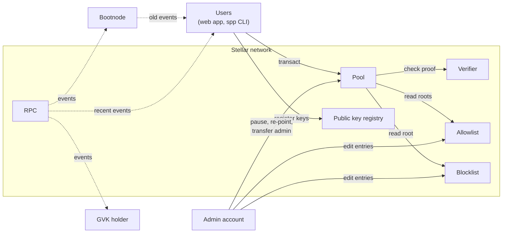

# Operator manual

This manual is for people who want to run their own privacy pool, their own ASP (association set
provider, the party that decides who may spend), or both. It assumes you know Stellar accounts and
the Stellar CLI, and no background in zero-knowledge proofs. The [Glossary](glossary.md) defines
every term the pages use.

Warning: the code is unaudited, and the committed circuit keys come from a local setup, not a
trusted setup ceremony. Don't hold real value in a deployment.

## Roles

A deployment has six roles. One organization can hold all of them.

| Role | Holds | Does |
| --- | --- | --- |
| Admin account signers | One signer key each | Approve admin calls: pause deposits, re-point pools, edit trees, transfer the admin |
| ASP | The admin of a tree | Adds members to the allowlist, adds and removes blocklist entries |
| GVK holder | A GVK private key | Decrypts every note in a `pool-gvk` pool |
| Bootnode operator | A server and a PostgreSQL database | Serves contract events older than the RPC keeps |
| App host | A static web server | Serves the web app and its admin page |
| Users | A Stellar wallet | Deposit, transfer, and withdraw |

## Components

No server holds user data or keys. The web app and the CLI rebuild each user's notes from contract
events, read through an RPC or, for events older than the RPC keeps, a bootnode.

## Pages

1. [How a pool works](how-a-pool-works.md): notes, the three operations, and what stays private.
2. [Run it locally](run-locally.md): a full deployment on your machine in four commands.
3. [Configuration](configuration.md): every choice a deployment makes, and which ones are final.
4. [Deploy a pool](deploy.md): circuit keys, the admin account, `deploy.sh`, the app, and the
   bootnode.
5. [Run an ASP](run-an-asp.md): add and remove allowlist members and blocklist entries.
6. [Compliance controls](compliance.md): what each control enforces and what it doesn't.
7. [Governance](governance.md): what the admin can do, and how to hand it over.
8. [Features and limits](features-and-limits.md): what users and operators can do, and the
   fixed limits.
9. [Glossary](glossary.md): the terms these pages use.
