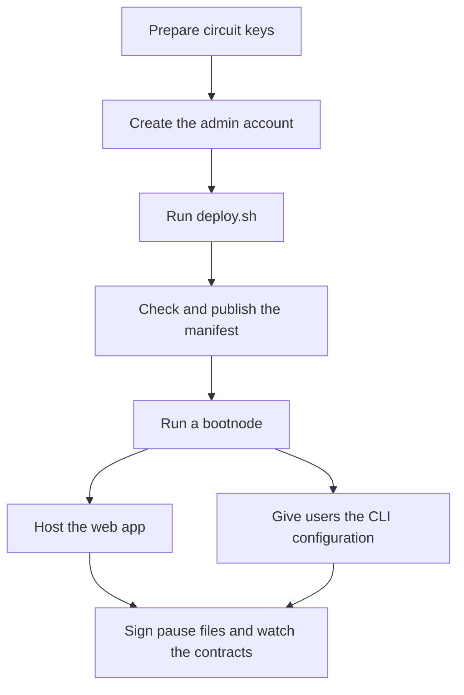

# Deploy a pool

This page takes a deployment from nothing to users transacting on a public network. The commands
use `testnet`; on another network, replace it with that network's Stellar CLI name. Decide the
values in [Configuration](configuration.md) first, because most can't change later.



## Prepare circuit keys

`deploy.sh` builds each verifier from a verifying key in `deployments/NETWORK/circuit_keys/`, and
clients check their circuit files against `deployments/NETWORK/circuits.json`. Testnet has both.
For any other network, start from the testnet files:

```bash
mkdir -p deployments/NETWORK
cp -R deployments/testnet/circuit_keys deployments/testnet/circuits.json deployments/NETWORK/
```

Replace `NETWORK` with the network's Stellar CLI name.

The committed keys come from a local setup, so whoever ran it could forge proofs. Before holding
real value, run a trusted setup ceremony with `tools/ceremony-cli`, export its keys into
`deployments/NETWORK/circuit_keys/`, and rewrite the lock with
`SPP_NETWORK=NETWORK make circuits-lock SETUP=ceremony`. For the ceremony, see the
[ceremony CLI README](https://github.com/NethermindEth/stellar-private-payments/blob/main/tools/ceremony-cli/README.md).

## Create the admin account

Create the admin account before you deploy, so the contracts name it from the start.
[Set up the admin account](../governance.md#set-up-the-admin-account) gives its shape and the
commands. For a quick test, leave out `--admin` below, and the deployer becomes the admin.

## Run deploy.sh

Create and fund a deployer, which pays for the deployment:

```bash
stellar keys generate deployer --network testnet --fund
```

Then deploy. This example deploys one native XLM pool with the blocklist policy:

```bash
deployments/scripts/deploy.sh testnet \
  --deployer deployer \
  --admin ADMIN_ACCOUNT \
  --policy-flags blocklist \
  --asp-levels 10 \
  --pool-levels 20 \
  --max-deposit 1000000000 \
  --kdf-domain KDF_DOMAIN \
  --pool native:$(stellar contract id asset --asset native --network testnet)
```

Replace the following:

- `ADMIN_ACCOUNT`: the admin account's address.
- `KDF_DOMAIN`: a string naming your deployment, which users see in the message they sign.

For more pools, GVK pools, and classic assets, see [Deploying pools](../deploy.md).

`deploy.sh` builds the contracts and deploys, in order: the allowlist, the blocklist, one verifier
for each policy and GVK mode in use, the public key registry, and each pool. It then writes the
manifest and checks the deployment against it, as
[Deploy under the admin account](../governance.md#deploy-under-the-admin-account) describes.

## Check and publish the manifest

The manifest, `deployments/NETWORK/deployments.json`, is how every client finds the contracts:

| Field | Meaning |
| --- | --- |
| `network`, `networkPassphrase`, `rpcUrl` | The Stellar CLI network name, its passphrase, and the default RPC |
| `kdf_domain` | The KDF domain |
| `deployer`, `admin` | The deployer's and the admin's addresses |
| `asp_membership`, `asp_non_membership` | The allowlist and the blocklist |
| `asp_membership_wasm_hash`, `asp_non_membership_wasm_hash` | The tree code every pool accepts |
| `added_asp_memberships` | Allowlists added after deployment by a re-point, each with its deployment ledger |
| `verifiers` | The verifiers, keyed by circuit: `B` for blocklist, `AB_gvk_T` for allowlist and blocklist with traceable GVK |
| `public_key_registry` | The registry |
| `pools` | One entry per pool: its address, token, asset, deployment ledger, policy, GVK mode and public key, and `enabled` |

Run the check again whenever the manifest changes:

```bash
deployments/scripts/verify-deployment.sh testnet
```

Publish the whole `deployments/NETWORK/` directory, with `circuits.json` and `circuit_keys/`, at a
URL your users can download from, for example next to the web app. The CLI and the bootnode read it
at runtime; the web app embeds it at build time.

## Run a bootnode

Clients rebuild their notes from contract events, and the public testnet RPC keeps events for
about seven days. After that, every new user, and every client that falls behind, needs a bootnode
that indexed the deployment from its first ledger. A bootnode started later can't fetch what the
RPC already dropped, so start one on the day you deploy.

The bootnode's Docker Compose file mounts the manifest named by `SPP_DEPLOYMENT_FILE` and passes it
to the bootnode as `BOOTNODE_DEPLOYMENT`. For a public bootnode, edit
`tools/bootnode/docker-compose.yml` first: set `BOOTNODE_DOMAIN` and `BOOTNODE_ACME_EMAIL` to your
domain and email for its TLS certificate, and change the PostgreSQL password and stop publishing
port 5432. Then, on a host that port 443 reaches:

```bash
cd tools/bootnode
SPP_DEPLOYMENT_FILE=/absolute/path/to/deployments.json docker compose up --build -d
```

The `docker-compose.no-https.yml` override serves plain HTTP for local testing only; an app served
over HTTPS can't call it. For systemd and every setting, see the
[bootnode README](https://github.com/NethermindEth/stellar-private-payments/blob/main/tools/bootnode/README.md).
Users trust the bootnode for the history it serves; for what it can do to them, see
[Bootnode](../bootnode.md).

## Host the web app

The app falls back to the project's hosted bootnode, which indexes only the project's own
manifest. Set `DEFAULT_BOOTNODE_URL` in `app/js/app-storage.js` to your bootnode, then build the
app for your manifest:

```bash
make circuits
SPP_NETWORK=NETWORK make release DIST_DIR=site PUBLIC_URL=/
```

Serve the `site/` directory as static files over HTTPS. It holds the user app at `index.html`, the
admin page at `admin.html`, the manifest, and the circuit files. Set `PUBLIC_URL` to the path you
serve it under. One build serves one manifest, so rebuild after every manifest change.

The site includes compiled circuits under the LGPLv3, which makes you their distributor. See
[Responsibility of deployers](../introduction.md#responsibility-of-deployers).

## Give users the CLI configuration

The [install script](../introduction.md#install-the-cli) sets the CLI up for the project's testnet
manifest. Your users download your deployment directory and point the CLI at it and at your
bootnode:

```bash
spp --deployment /path/to/NETWORK onboard --account ACCOUNT --bootnode-url BOOTNODE_URL
```

Replace the following:

- `/path/to/NETWORK`: where the user saved your deployment directory.
- `ACCOUNT`: the user's Stellar CLI identity.
- `BOOTNODE_URL`: your bootnode's URL.

A user who sets `deployment` under `[defaults]` in `~/.config/spp/config.toml` can leave out
`--deployment`.

## Sign pause files and watch the contracts

Before users arrive, have the admin account's signers sign a pause file for each pool, as
[Pre-sign deposit pauses](../governance.md#pre-sign-deposit-pauses) describes. Then watch the admin
account and the contracts for the events that
[Watch the account and the contracts](../governance.md#watch-the-account-and-the-contracts) lists.
The repository ships no watcher, so run one of your own.
