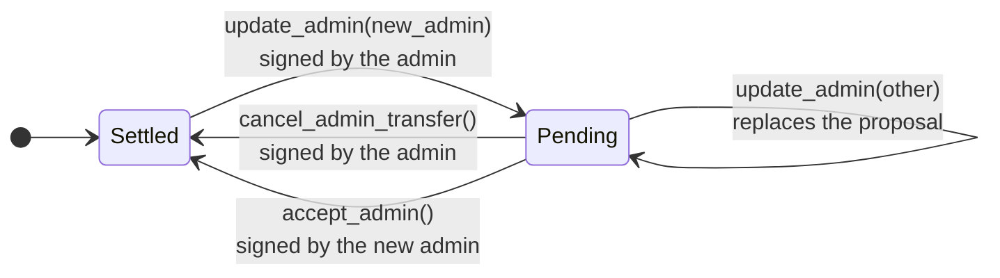

# Governance

Each pool and each tree has one admin, set at construction, and `deploy.sh` gives them all the same
one. Use a Stellar account as the admin, made M-of-N with M of at least 2, so no single lost or
stolen key controls the deployment. `verify-deployment.sh` fails a contract admin on mainnet,
because it has no signers to check. This page explains the model; the
[Governance runbook](../governance.md) has the procedures.

## What the admin can do

| The admin can | The admin can't |
| --- | --- |
| Pause and unpause deposits into a pool | Stop transfers or withdrawals |
| Add allowlist members, add and remove blocklist entries | Remove an allowlist member except by re-pointing |
| Re-point a pool to another tree of its tree code | Re-point to a tree of other code |
| Propose a new admin, or cancel the proposal | Change the token, verifier, maximum deposit, policy, or GVK |
| | Upgrade any contract |

Every admin call needs M signatures. The admin page builds the call, and each signer reviews and
signs it on their own device before anyone submits it.

## Transfer the admin

A transfer takes two calls on each pool and tree, one from each side:

The current admin keeps every power until the new admin accepts, so a proposal to a wrong address
does no harm. Transfer the admin only to move the contracts to another organization's account. To
change who signs, replace signers on the same account; that needs no contract call.

## Pause deposits

Collecting M signatures takes longer than a soundness bug in a circuit or contract allows, so the
signers sign pause files ahead of time. A holder submits one with no signer present, and it stops
deposits into one pool while users keep transferring and withdrawing. Each file works once and
expires after about 180 days.

## Procedures

| Task | Runbook section |
| --- | --- |
| Create the admin account | [Set up the admin account](../governance.md#set-up-the-admin-account) |
| Watch the account and the contracts | [Watch the account and the contracts](../governance.md#watch-the-account-and-the-contracts) |
| Sign and submit an admin call | [Make an admin call](../governance.md#make-an-admin-call) |
| Sign pause files | [Pre-sign deposit pauses](../governance.md#pre-sign-deposit-pauses) |
| Hand the contracts to another account | [Transfer the admin](../governance.md#transfer-the-admin) |
| Switch a pool to another tree | [Re-point a pool](../governance.md#re-point-a-pool) |
| Replace a signer | [Replace a signer](../governance.md#replace-a-signer) |
| Respond to a lost key, a bug, or a sanction | [Incidents](../governance.md#incidents) |
