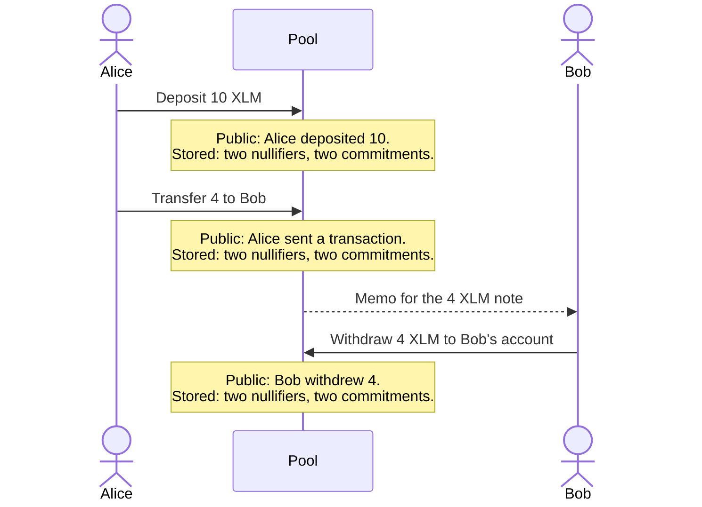

# How a pool works

A pool is a contract that holds one token. Users move value into it, between each other inside
it, and out of it. Inside the pool, value sits in notes instead of account balances, and a
zero-knowledge proof stands in for the signature that would reveal who owns what.

## Notes

A note is an amount, the note public key of its owner, and a random blinding. The note public key
is the public half of a key pair each user derives for owning notes; [Keys](#keys) covers it. The
pool never stores a note. It stores the note's commitment, a hash of those three values, in its
commitment tree, a Merkle tree whose top hash, the root, changes with every insert. The note
itself travels as a memo encrypted to the owner's encryption key, inside the event that announces
the commitment. Only the owner can decrypt the memo.

To spend a note, its owner proves four things without revealing the note:

- They know the note's contents and the note private key that owns it.
- The note's commitment is in the commitment tree under one of its last 90 roots.
- The nullifier they submit is the one derived from that note and key.
- The amounts balance: the notes spent plus any deposit equal the notes created plus any
  withdrawal.

The pool records each nullifier it accepts, so a second spend of the same note fails. An observer
cannot tell which commitment a nullifier belongs to.

## Transactions

Every operation is one call to the pool's `transact` entry point. Each call spends exactly two
notes and creates exactly two, filling unused slots with zero-value notes, so every transaction
publishes two nullifiers and two commitments whatever it does.

| Operation | Notes spent | Notes created | Tokens move | Public on chain |
| --- | --- | --- | --- | --- |
| Deposit | Two zero-value notes | Two, holding the deposit | From the sender to the pool | Sender and amount |
| Transfer | One or two of the sender's | Two: the recipient's and the sender's change | None | Sender |
| Withdraw | One or two of the sender's | Two, holding any change | From the pool to the recipient | Sender, recipient, and amount |

The sender is the Stellar account that authorizes the call, and it is public in every operation.
The amount of a transfer and its recipient stay private. A payment that needs more than two of the
sender's notes takes several transactions, which the clients plan and submit in sequence.

The following sequence shows three transactions in one pool:

An observer sees that 10 went in and 4 came out. Nothing on chain says that Bob's 4 came from
Alice's 10. In a busy pool, Bob's withdrawal could have come from any earlier deposit. With few
users, timing and amounts can link the two. For every value the contracts publish, see
[Contract event privacy](../privacy-tradeoffs.md).

## What the pool checks

The pool runs these checks on every `transact`, in this order, and refuses the call at the first
failure:

1. The sender authorized the call.
2. For a deposit: deposits are not paused, the amount is at most the maximum deposit, and the
   tokens move from the sender to the pool.
3. The proof's root is one of the pool's last 90 roots.
4. No nullifier has been spent.
5. The proof commits to this call's recipient, amount, and memos, and to this pool and token, so
   nobody can reuse it elsewhere.
6. The amount the proof commits to matches the deposit or withdrawal.
7. For a blocklist pool, the proof's blocklist root is the blocklist's current root. For an
   allowlist pool, the proof's allowlist root is one of the allowlist's last 90 roots.
8. The verifier accepts the proof.

The pool then records the nullifiers, sends a withdrawal's tokens to the recipient, adds the two
new commitments, and publishes one event for each nullifier and commitment.

## Keys

Each user has one Stellar account and three keys derived from it. Their wallet signs the message
`Privacy Pool Key Derivation [v2] (KDF_DOMAIN)`, where `KDF_DOMAIN` is the deployment's KDF
domain, and the client derives everything below from that signature:

| Key | Used for |
| --- | --- |
| Note key | Owns notes. The ASP screens its public half. |
| Encryption key | Receives note memos. |
| ASP secret | Blinds the user's allowlist leaf. The derivation also mixes in the manifest's network name. |

The same wallet and KDF domain always produce the same keys, so a user who loses their local data
signs again and the client rebuilds their notes from events. Only app settings and the record of
their past operations are gone. A deployment with another KDF domain gives the same wallet
different keys.

To receive a transfer, a user shares their note public key and encryption public key. They can
publish both in the public key registry, which lets senders pay a Stellar address directly, at the
cost of linking that address to the keys in public.
