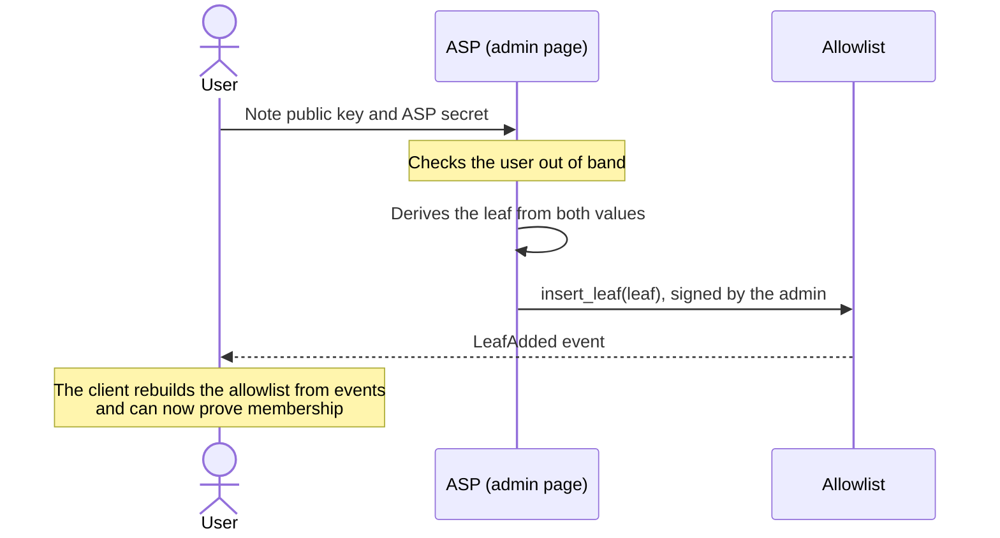

# Run an ASP

An ASP decides who may spend from a pool by maintaining its allowlist, its blocklist, or both.
Being an ASP means being the admin of a tree. `deploy.sh` makes the deployment's admin account the
admin of both trees, so by default the operator is also the ASP.

Every write to a tree is an admin call: the admin page builds it, and the admin's signers sign it.
For the signing flow, see [Make an admin call](../governance.md#make-an-admin-call).

## Allowlist and blocklist

| | Allowlist | Blocklist |
| --- | --- | --- |
| Contract | `asp-membership` | `asp-non-membership` |
| Entry | A leaf: the hash of the user's note public key and ASP secret | The user's note public key itself |
| Public on chain | The leaf, which nobody can link to the user without their ASP secret | The note public key |
| Add | `insert_leaf` | `insert_leaf`, or `insert_leaves` for several keys at once |
| Remove | No delete. Re-point the pools to a new allowlist. | `delete_leaf`, one key per call |
| Capacity | 1,024 leaves | No fixed limit |
| Roots a pool accepts | Any of the last 90 | Only the current one |

The accepted roots matter to users. A client proves against the roots it reads when it builds the
proof. An allowlist write leaves that proof valid for the next 89 writes. A blocklist write voids
it in every pool that reads the blocklist, and the client has to prove again.

## Add a member to the allowlist



1. The user sends their note public key and ASP secret. The app shows both under Settings, and
   the CLI prints them with `spp keys` and `spp asp-secret`.
2. Check the user through your own process. The contracts take any key you insert, and the ASP
   secret lets you link the user's leaf to them, so treat it as personal data.
3. On the admin page's Allowlist tab, enter both values and press Add to Allowlist. The page
   derives the leaf and builds the admin call.
4. Once the call lands, the user can deposit. Before then, the app tells them to share their keys
   with the ASP.

The ASP secret depends on the user's wallet, the KDF domain, and the manifest's network name, so
a user needs a separate leaf in each deployment.

## Remove a member from the allowlist

An allowlist can't delete a leaf. To remove a member, build a new allowlist with every leaf except
theirs and re-point each pool that reads the old one, as [Re-point a
pool](../governance.md#re-point-a-pool) describes. Once a pool reads the new allowlist, the removed
member's notes in it can't move, so ask them to withdraw first.

A pool reads one allowlist, and its depth is fixed at 10 levels, so a pool has at most 1,024
members. A full allowlist can only be replaced by one that drops members.

## Block and release keys

On the admin page's Blocklist tab, paste note public keys in the form the app shows them, one per
line, and press Add to Blocklist. Several keys become one call. Remove from Blocklist takes one key
per call.

Write to the blocklist through the admin page. It converts each key to the byte order the contract
expects; a key passed raw to `insert_leaf` through the Stellar CLI is stored reversed, and its owner
stays unblocked.

## Run a tree for another operator's pool

A pool accepts only trees of its tree code. To run a tree for a pool another operator runs:

1. Record the latest ledger as the tree's deployment ledger, read the tree code the pool accepts,
   and deploy your tree from it:

   ```bash
   stellar ledger latest --network testnet
   stellar contract invoke --id POOL --source-account DEPLOYER --network testnet --send=no \
     -- get_asp_wasm_hashes
   stellar contract deploy --wasm-hash HASH --source-account DEPLOYER --network testnet \
     -- --admin ASP_ADMIN --levels 10
   ```

   Replace the following:

   - `POOL`: the pool's address.
   - `DEPLOYER`: a funded Stellar CLI identity that pays for the deployment.
   - `HASH`: the first hash printed for an allowlist, or the second for a blocklist.
   - `ASP_ADMIN`: the address of the account that will administer your tree.

   A blocklist takes only `--admin`, so drop `--levels 10` for one.
2. Enter your tree's address in the admin page's Overview tab, and load the entries on the
   Allowlist or Blocklist tab, signing as `ASP_ADMIN`.
3. Send the pool's operator the tree's address, its deployment ledger, and your records of its
   entries. They check the tree on the Re-point panel and re-point their pool. For an allowlist,
   they first add it to `added_asp_memberships` in their manifest with `ASP_ADMIN` as its admin,
   because clients refuse an allowlist the manifest doesn't name.

The Re-point panel reads the tree's entries from its events, so step 3 has to finish while the tree
is younger than the RPC's event retention, about seven days on the public testnet RPC. After the
re-point, you edit the tree and the pool's operator decides whether their pool keeps reading it.
